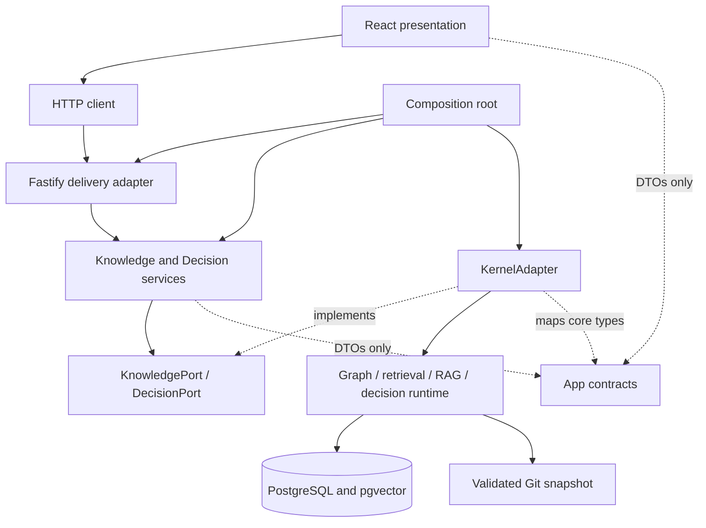
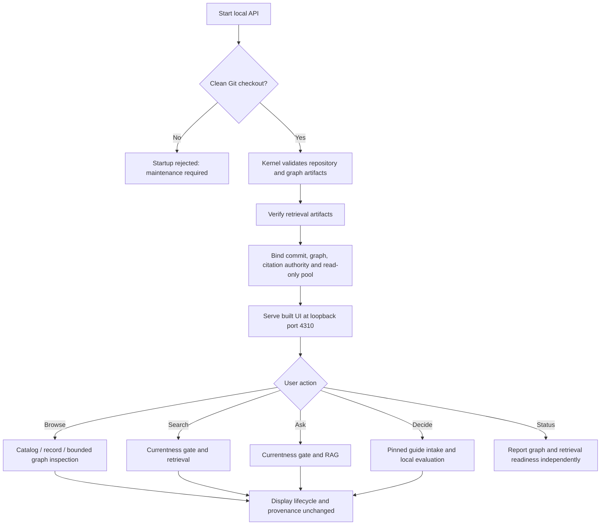

# App architecture and flows

Status: **proposed engineering decisions, implemented local pilot**. No knowledge lifecycle or
governance decision is promoted by this document. Owner: Ansha Cerbia.

The user's “beyond FAANG” direction is interpreted as measurable engineering discipline, not a
superiority claim or a company-specific certification. This app implements modularity, inward
dependencies, bounded requests, provenance and tests. It does not claim measured production
scalability, high availability or semantic accuracy.

Atlas now lives at `apps/atlas` in the kernel workspace. The tree below is relative to that
directory. See the [hardening decision](../../../docs/structural-integration-hardening.md) for
migration details, evidence and remaining limitations.

## 1. Modules and dependency rule

```text
apps/
  api/src/
    main.ts                    composition root, process lifecycle
    config.ts                  operator configuration
    http-server.ts             HTTP adapter, local security, shared envelopes/errors
    decision-routes.ts         closed decision-session HTTP contracts
  web/src/
    api/                       browser HTTP client
    pages/                     route-level lazy feature views
    components/                reusable presentation, evidence inspector
    tokens.css                 visual tokens
    styles.css                 responsive layout
packages/
  contracts/src/               app-owned DTOs; zero runtime imports
  application/src/             use cases, errors, KnowledgePort, DecisionPort, shared limiter
  knowledge-adapter/src/       kernel bridge, snapshot policy, DB/read adapters
tests/
  architecture.test.ts        static/dynamic import boundary checks
  application.test.ts         application policy and safe links
  http.test.ts                transport, security and error contracts
  kernel-adapter.test.ts      mocked integration-boundary regressions
  snapshot.test.ts            isolated real Git currentness check
  browser/                    Chrome/Chromium user flows
docs/                         decisions, evidence and handoff
```



Dependency inversion is literal: the application imports its port, not the adapter. Domain semantics
remain in the existing governed kernel; the app does not duplicate its ontology or introduce a
ceremonial parallel domain model. Only the composition root constructs concrete dependencies. This
is a modular monolith with two workspace packages and one deployment unit, not a distributed
architecture.

## 2. Choices, costs and alternatives

| Decision                                         | Applies / does not apply                                                          | Benefits and costs                                                                                                                         | Failure modes, security and verification                                                                                                                         |
| ------------------------------------------------ | --------------------------------------------------------------------------------- | ------------------------------------------------------------------------------------------------------------------------------------------ | ---------------------------------------------------------------------------------------------------------------------------------------------------------------- |
| React/Vite SPA + Fastify modular monolith        | Single-user local inspection; not public SEO or multi-tenant SaaS                 | One API process; route chunks; extra frontend build. Alternative: Next.js when server rendering becomes necessary                          | API failure affects dynamic views; build, deep-link and browser tests                                                                                            |
| Compiled workspace runtime facade                | Joint kernel/app delivery                                                         | One lockfile, public exports, explicit test seams; package publishing remains an alternative for independent releases                      | Build required before app; private-import regression tests and same-commit CI                                                                                    |
| PostgreSQL remains a derived read model          | Search/RAG; graph can work without DB                                             | Reuses tested schema/currentness; requires DB operation. Alternative SQLite/graph DB would require migrations and fresh evidence           | Missing/stale DB fails closed; separate graph readiness; no server migrations                                                                                    |
| Explicit local/hosted database mode              | Local pgvector or a TLS-protected hosted PostgreSQL endpoint                      | Hosted mode avoids local database footprint; knowledge units leave the device. Artifact-only retrieval would be a distinct degraded engine | Hosted mode requires credentials, TLS and channel binding; secrets remain server-only; configuration tests                                                       |
| Complete grounded answer delivery                | Evidence-sensitive single-turn Q&A; not raw conversational token streaming        | No rejected draft reaches the UI; longer visible wait. Alternative validated per-statement streaming needs a new audited protocol          | Client shows pending/error; output failures discard answer; adversarial API/UI tests                                                                             |
| Startup validation and pinned in-memory snapshot | Trusted local checkout; startup excludes concurrent writers by operational policy | Git checks only at startup; detached frozen records; endpoint DTOs are copies                                                              | Edits are visible after restart, not hot reload. DB content integrity remains checked before/after retrieval; startup checks cannot detect edit-and-revert races |
| Stateless browser session                        | Pilot; no durable memory or collaborative sessions                                | No chat database or retention job; navigating away clears answer                                                                           | No history is sent implicitly; repeated questions recompute; browser tests                                                                                       |
| Local deterministic decision evaluation          | Three proposed M7.2 guides; not free-text fact extraction or automatic approval   | No provider/DB egress and reproducible rules; requires explicit human confirmation. Alternative model-assisted intake needs new governance | Unknowns produce clarification; every result passes independent semantic validation; runtime, HTTP and browser regressions                                       |
| Loopback and process token                       | One trusted OS account; not authentication or tenant isolation                    | Blocks ordinary cross-origin calls and rebinding Host values; simple local setup                                                           | Same-OS processes remain trusted. Auth, authorization and durable audit are prerequisites for network exposure                                                   |

Stack choices are consistent with [Vite's guide](https://vite.dev/guide/),
[Fastify's schema validation boundary](https://fastify.dev/docs/latest/Reference/Validation-and-Serialization/)
and
[TanStack Query's server-state model](https://tanstack.com/query/latest/docs/framework/react/overview).
These references justify integration mechanisms, not comparative performance claims.

## 3. Actual application flow



The app does not expose the entire core CLI command surface. Catalog is an in-memory filter, not a
substitute database fallback. Graph inspection is bounded to 40 immediate edges; the record
inspector shows all recorded immediate references. Traversal exclusions and edge-local conditions
are kept visible. Retrieval expansion remains controlled by the kernel's governed traversal policy,
not the visualization.

## 4. Detailed search/RAG flow

```mermaid
sequenceDiagram
  actor U as Local user
  participant W as React UI
  participant H as HTTP adapter
  participant A as Application
  participant K as Kernel adapter
  participant D as PostgreSQL
  participant R as Existing RAG engine
  participant P as Deterministic provider
  U->>W: Submit question and classification
  W->>H: Bootstrap local POST token if needed
  W->>H: POST strict single-turn body + token
  H->>H: Host / Origin / token / body schema checks
  H->>A: ask(input)
  A->>A: Acquire bounded slot, max 2
  A->>K: ask(input)
  K->>K: Use startup-validated pinned snapshot
  K->>D: Check generation, contract and manifest currentness
  alt Missing DB or stale index
    K-->>H: Safe technical error
    H-->>W: 503/409 + request ID, no answer
  else Current retrieval generation
    K->>R: RagEngine.answer(parsed request)
    R->>D: Lexical + vector candidates, then eligible graph expansion
    R->>R: Context budgets and registered citation authority
    alt No evidence
      R-->>K: insufficient-evidence; model not invoked
    else Evidence exists
      R->>P: Context + classification + no recommendations
      P-->>R: Structured output
      R->>R: Parse and validate grounding, references and labels
      alt Invalid output
        R-->>H: Failure; no partial answer released
      else Grounding contract passes
        R-->>K: Answer / refusal + resolved citations
      end
    end
    K->>K: Retain the same immutable in-memory snapshot
    K->>D: Recheck generation and manifest
    K-->>A: App-owned DTO only if still current
    A-->>H: Release slot in finally
    H-->>W: Versioned envelope, request ID and repository commit
    W-->>U: Complete answer, uncertainty and evidence inspector
  end
```

The existing kernel performs ranking/graph expansion, context construction, citation authority and
grounding. The app does not substitute its own evaluation or relax gates. Successful citation
resolution is not proof of semantic entailment. Refusal and insufficient evidence are distinct from
database/network/grounding failures.

### Decision Assistant flow

```mermaid
sequenceDiagram
  actor U as Local user
  participant W as React Decision page
  participant H as Fastify decision routes
  participant A as DecisionService
  participant K as KernelAdapter
  participant E as Snapshot-bound evaluator
  participant V as Independent semantic validator
  U->>W: Select one of three proposed guides
  W->>H: GET catalog and pinned intake
  H-->>W: Context, constraints, drivers, conditions + commit
  U->>W: Enter values and explicitly confirm assessments
  W->>H: POST session v3 + commit + client revision
  H->>H: Host / Origin / token / closed-schema checks
  H->>A: evaluate(input)
  A->>A: Verify commit and acquire shared bounded slot
  A->>K: evaluateDecision(ephemeral session)
  K->>E: Evaluate three-valued applicability locally
  E->>V: Validate recommendation v4 and evidence closure
  alt Any constructed result is invalid
    V-->>W: Safe operational error; no partial recommendation
  else Result validates
    V-->>K: Validated recommendation only
    K-->>W: Result + clarification prompts + matching revision
    W->>W: Discard if revision or snapshot no longer matches
    W-->>U: Options, trade-offs, verification, uncertainty and evidence
  end
```

The decision path imports no provider connector, retrieval engine or database. Browser draft and
result state stay in the mounted component rather than query cache or web storage. Edits clear the
prior result immediately; unmount aborts the request. This is application-level non-retention, not
secure erasure of browser or operating-system memory.

## 5. HTTP and observability contract

| Route                                    | Function                                          | DB required   |
| ---------------------------------------- | ------------------------------------------------- | ------------- |
| `GET /health/live`                       | Process liveness                                  | No            |
| `GET /health/ready`                      | Full graph + retrieval readiness, 503 if degraded | Yes for ready |
| `GET /api/v1/bootstrap`                  | Process-local POST token                          | No            |
| `GET /api/v1/status`                     | Partial readiness + counts + safe diagnostic code | Checked       |
| `GET /api/v1/catalog`                    | All record summaries from validated snapshot      | No            |
| `GET /api/v1/records/:id`                | Record fields and immediate references            | No            |
| `GET /api/v1/graph/:id`                  | At most 40 immediate edges                        | No            |
| `POST /api/v1/search`                    | Bounded index retrieval, 10 results               | Yes           |
| `POST /api/v1/rag/answers`               | Grounded single-turn Q&A                          | Yes           |
| `GET /api/v1/decision-guides`            | Runtime-enabled proposed guides                   | No            |
| `GET /api/v1/decision-guides/:id/intake` | Pinned guide intake definition                    | No            |
| `POST /api/v1/decision-evaluations`      | Ephemeral validated recommendation                | No            |

Success envelopes carry `contract_version`, server-generated `request_id`, `repository_commit` and
`data`. RAG provenance adds generation, graph and retrieval fingerprints, model contract and
classification. Errors contain safe code/message and request ID; no raw stack or credentials. Logs
contain route templates, request IDs, status codes and elapsed time, not bodies or raw URLs. This is
operational traceability, not a durable audit ledger or distributed tracing system.

Strict request schemas reject unknown properties and type coercion. Hosted database configuration
additionally requires explicit mode, credentials, TLS and channel binding; the URL never enters an
API response or log. Maximum body 64 KiB, question 4000 characters, concurrent search/RAG operations
2, DB pool 4, connection acquisition 3 seconds, statement timeout 10 seconds, query timeout 15
seconds. Read-only transaction mode supplements a recommended operator-managed SELECT-only role. No
URL/path/SQL/model endpoint can be supplied through the public request DTOs. Decision evaluation
shares the two-operation admission limit, pins the repository SHA and client revision, caps each
context string at 4000 characters, and requires provider authorization to remain false/null.

## 6. Scalability and remaining work

Currentness checking still verifies DB content before and after retrieval; no Git subprocess or
source filesystem read occurs on catalog, record or graph requests. The snapshot is fixed until
restart. An informational benchmark compares catalog access with the former Git guard and measures
optional DB work; no production SLO is claimed. Catalog responses and record connection lists are
not paginated yet. The graph display and search result count are bounded. Before a larger corpus,
add server pagination, request-time budgets, benchmark datasets and immutable snapshot deployment.

Before multi-user access: authentication, authorization, per-user limits, secrets management,
classified-data controls, retention policy, CSRF/session lifecycle redesign, tenant isolation,
durable audit, backup/restore and measured load tests. Before a real provider: explicit operator
authorization, provider-specific budgets/timeouts, semantic quality evaluation and disclosure. No
live provider is silently enabled by an API key.

The imported RAG kernel has no propagated AbortSignal through its full engine interface. This
release does not offer a misleading “stop billing” control. Only pending state and complete
validated answers are displayed. Decision evaluation is local and receives browser
abort/stale-response handling, but cancellation is not presented as secure erasure. Persistent
collaboration, model-assisted context extraction, artifact generation, broader corpus work and
multi-user review remain later scopes; no M7 completion is implied.
