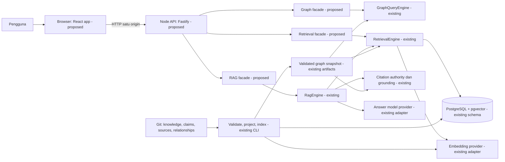

# Local Knowledge App Architecture

Historical design baseline. Current workspace implementation and snapshot semantics:
[Atlas architecture](../apps/atlas/docs/architecture.md) and
[structural hardening](structural-integration-hardening.md).

Tanggal: 2026-09-16. Status: **proposed design**.
Baseline inspeksi: `aa627019c3c29c08a1de94bdfa2f1e7c6f9b0c4f`.

Dokumen ini menyiapkan arsitektur app sesuai permintaan pemilik. Endpoint,
folder app, dan komponen berlabel proposed belum diimplementasikan. Persetujuan
untuk merancang app tidak mengubah lifecycle knowledge atau menyelesaikan M7.
Diagram detail berada di [App and RAG Flows](local-app-flows.md).

## 1. Bentuk app yang diusulkan

App pertama berjalan di laptop satu pengguna: browser membuka satu alamat lokal,
backend menyediakan API dan file frontend hasil build, PostgreSQL/pgvector
menyimpan indeks pencarian. Backend memanggil mesin graph/retrieval/RAG yang
sudah ada sebagai library. Provider embedding dan provider jawaban adalah dua
dependensi terpisah, walaupun nanti memakai layanan eksternal yang sama.

Fitur awal: Search, Concept Detail, Graph Explorer, Ask Knowledge, Evidence
Inspector, dan System Status. Tiga decision guide dapat dibaca sebagai knowledge.
Pemilihan arsitektur proyek secara otomatis, penyimpanan decision session, dan
generator ADR/RFC/PAD tetap merupakan pengembangan M7 tersendiri.

### Diagram komponen



Panah ke provider berarti panggilan dari proses server/operator. Browser tidak
menerima database credentials atau API key. Pada mode fake, provider berada
di proses Node dan tidak mengirim data ke layanan model eksternal.

## 2. Apa yang sudah ada dan apa yang perlu dibuat

| Kemampuan | Bukti implementasi saat ini | Pekerjaan app proposed |
| --- | --- | --- |
| Graph query | [Graph engine](../src/graph-query.ts), [CLI](../src/graph-cli.ts) | Endpoint dan visualisasi subgraph berbatas |
| Search teks/vector/graph | [Retrieval engine](../src/retrieval-query.ts) | API dengan filter dan hasil yang mudah dibaca |
| Database | [Migrasi dasar](../migrations/0001_retrieval.sql), [guide units](../migrations/0002_decision_guide_retrieval.sql) | Pool untuk server jangka panjang, readiness, role baca |
| Generasi indeks | [Indexer](../src/retrieval-indexer.ts) | Prosedur maintenance dan startup yang jelas |
| Question dan answer contracts | [Request parser](../src/rag-request.ts), [types](../src/rag-types.ts) | HTTP envelope berversi dan adapter UI |
| Evidence dan citation | [Context builder](../src/rag-context.ts), [authority](../src/rag-citation-authority.ts) | Evidence Inspector yang mempertahankan provenance |
| Jawaban RAG | [Engine](../src/rag-engine.ts), [provider](../src/rag-provider.ts) | Orkestrasi request, progres, penanganan error |
| Session/recommendation validation | [Decision validation CLI](../src/decision-validation-cli.ts) | Bukan mesin decision assistant yang otomatis berjalan |

CLI memiliki side effect saat di-import. Backend baru harus mengimpor library
mesin dan mengekstrak runtime factory yang diperlukan, bukan mengimpor file CLI
atau mengeksekusi shell dari input pengguna.

## 3. Keputusan desain dan alternatif

Semua pilihan pada tabel ini adalah usulan untuk local pilot.

| Pilihan | Alasan dan manfaat | Biaya, alternatif, batas berlaku | Verifikasi |
| --- | --- | --- | --- |
| React + Vite untuk frontend | Cocok untuk interaksi search/graph/chat; tidak perlu SSR untuk app lokal | Build frontend terpisah; Next.js layak bila SSR atau deployment terpadu menjadi kebutuhan | Build production, routing refresh, E2E browser |
| Fastify pada Node yang dipakai repo | HTTP adapter jelas di sekitar mesin TypeScript; satu proses backend | Tambahan framework; Express atau native HTTP alternatif lebih minimal tetapi perlu lebih banyak wiring | Strict request/response contracts, resource cleanup, HTTP integration |
| Modular monolith | Satu runtime dan satu DB mudah dioperasikan untuk satu pengguna | API dan core berbagi resource; service terpisah baru dipertimbangkan setelah beban terukur | Uji restart, konkurensi berbatas, pool exhaustion |
| PostgreSQL/pgvector yang ada | Memakai indexing dan currentness contract yang telah diuji | DB harus dijalankan; SQLite atau graph DB membutuhkan migrasi dan evaluasi baru | Migrasi, index/check, DB integration |
| Git sebagai sumber knowledge | Claims, IDs, lifecycle dan history tetap dapat dilacak | Perubahan memerlukan validate/index/restart; edit langsung di DB bukan jalur authoring | Tampered/stale generation ditolak |
| Jawaban lengkap setelah grounding | UI tidak menampilkan teks yang kemudian ditolak validator | Waktu tunggu terlihat; progres proses disediakan melalui event | Invalid output tidak pernah masuk komponen jawaban |
| Riwayat tampilan di memori browser | Sederhana dan tidak menambah penyimpanan percakapan | Hilang saat refresh; setiap pertanyaan berdiri sendiri | Refresh menghapus tampilan; history tidak dikirim diam-diam |

Vite mendokumentasikan [integrasi backend](https://vite.dev/guide/backend-integration)
dan [proxy development](https://vite.dev/config/server-options.html#server-proxy).
Fastify mendukung [validasi dan serialisasi berbasis schema](https://fastify.dev/docs/latest/Reference/Validation-and-Serialization/).
Keputusan memakai keduanya adalah penilaian desain untuk repo ini, bukan hasil
benchmark framework. Versi dependency dipilih dan dipin saat implementasi.

## 4. Batas modul dan susunan folder proposed

```text
apps/web/                   package frontend; tidak mengimpor kode server
  src/pages/                Search, Graph, Ask, Status
  src/components/           ConceptCard, GraphCanvas, ChatMessage, EvidencePanel
  src/api/                  HTTP client dan chat transport
src/app/                    backend di package root yang sudah ada
  server.ts                 lifecycle HTTP, static assets, graceful shutdown
  config.ts                 konfigurasi tervalidasi, repoRoot eksplisit
  runtime.ts                graph snapshot, citation authority, pool, providers
  routes/                   health, records, graph, search, RAG
  contracts/                HTTP DTO; tidak membawa DB/secrets ke browser
src/                        mesin dan validators existing tetap dapat dipakai CLI
tests/app/                  HTTP, runtime dan kontrak baru
apps/web/tests/             komponen dan E2E browser
```

`pnpm-workspace.yaml`, package frontend, build scripts, HTTP DTO dan test jobs
adalah pekerjaan implementasi berikutnya. Jangan memindahkan seluruh core hanya
untuk membuat UI. Export boundary untuk DTO harus eksplisit agar bundler tidak
membawa `pg`, filesystem, provider secrets atau validator runtime ke browser.

Dalam development, usulan port Vite `127.0.0.1:5173` mem-proxy `/api` ke Node
`127.0.0.1:4310`. Dalam build lokal, Node melayani frontend dan API pada port 4310.
Database tetap `127.0.0.1:54329` sesuai [Compose](../docker-compose.retrieval.yml).
Nomor port app adalah usulan dan harus configurable.

## 5. Data dan sumber kebenaran

| Data | Lokasi | Pemilik perubahan dan masa hidup |
| --- | --- | --- |
| Concept, claim, source, relationship, guide | Git YAML/Markdown | Authoring lewat perubahan repository dan governance |
| Graph dan retrieval artifacts | `generated/` | Generator deterministik; tidak diubah frontend |
| `retrieval_generations` | PostgreSQL | Indexer; status building/ready/active/failed/superseded |
| `retrieval_units` | PostgreSQL | Indeks teks, vector, metadata, citation per generation |
| `retrieval_embedding_cache` | PostgreSQL | Reuse berdasarkan content hash dan provider contract |
| `retrieval_schema_migrations` | PostgreSQL | Ledger migrasi schema DB |
| Graph snapshot dan citation authority | Memori backend | Satu bundle tervalidasi pada startup |
| Input dan hasil chat yang tampil | Memori tab browser | Dihapus saat clear/refresh; bukan persisted session |
| API keys dan koneksi DB | Konfigurasi server/operator | Tidak masuk Git, log body, response atau frontend bundle |

Schema existing memiliki satu active generation per database dan vector 1536
dimensi. Pergantian embedding provider/model/contract membutuhkan index yang
cocok; frontend tidak boleh mengganti embedding provider per pertanyaan. Model
penyusun jawaban adalah pilihan terpisah. Mode fake diberi label demo; hasilnya
tidak diperlakukan sebagai bukti kualitas model sungguhan.

Usulan privilege: proses app menggunakan DB role read-only untuk query/currentness;
operator indexing memakai role penulis/migrasi terpisah. Compose saat ini masih
memakai satu akun pengembangan; pemisahan role tersebut belum ada.

## 6. Kontrak HTTP proposed

Prefix `/api/v1`. Endpoint belum tersedia sekarang. Body JSON memakai validasi
tanpa coercion, tanpa silently remove unknown fields, dan tanpa browser-supplied
JSON schema. Schema HTTP terpisah dari schema knowledge; parser core tetap
memeriksa semantik. Fastify defaults harus dikonfigurasi agar tidak melemahkan
aturan strict repo. Response serializer harus mempertahankan qualifier/provenance.

| Endpoint | Input | Hasil dan dependensi |
| --- | --- | --- |
| `GET /health/live` | Tidak ada | Proses hidup; tidak memanggil model |
| `GET /health/ready` | Tidak ada | Readiness HTTP 200/503 plus graph/search/RAG capabilities |
| `GET /api/v1/status` | Tidak ada | Mode fake/live, capability, SHA, generation, alasan tidak siap; tanpa secrets |
| `GET /api/v1/records/:id` | ID terdaftar | Detail concept/claim/source/guide/relationship dari snapshot; tanpa DB |
| `POST /api/v1/graph/query` | Operasi allowlist, ID, depth dan limit | Subgraph, direction, predicates, conditions, diagnostics; tanpa DB |
| `POST /api/v1/search` | `RetrievalRequest` sesuai batas server | `RetrievalPacket` dalam envelope; DB/currentness/provider sesuai mode |
| `POST /api/v1/rag/context` | Question request | Evidence preview; bisa memanggil embedding, tidak memanggil model jawaban |
| `POST /api/v1/rag/answers` | Question request | `RagAnswerPacket` lengkap dalam envelope JSON |
| `POST /api/v1/rag/stream` | Question request yang sama | Event progres dan satu final validated packet; adapter untuk UI |

Graph query awal hanya `get`, `neighbors`, `traverse`, `path`, `claims`, `evidence`
dan lookup guide yang diperlukan UI. Query arbitrary SQL, filesystem path,
provider URL dan executable command tidak menjadi input API.

Question request minimal: `{ "question": "...", "data_classification": "public" }`.
Request parser core memiliki batas 4000 karakter, default `hybrid-graph`, `top_k=12`,
`candidate_k=40`, graph depth 1, budget 12 units / 6000 estimated tokens, dan
recommendations disabled. Acuan: [request parser](../src/rag-request.ts).
App awal memakai policy public-only dan memverifikasi deklarasi terhadap policy
server; label dari browser tidak membuktikan isi bebas data sensitif.

Client tidak mengirim hasil retrieval, evidence IDs, source URLs atau citation
catalog untuk dipercaya backend. Context preview dan answer adalah dua request
independen; answer membangun evidence lagi. Jika generation berubah, UI menandai
preview lama. `E0001` dan `C0001` hanya lokal per packet; ID AKC/AKL/AKS/AKR/AKG
tetap identitas record repository.

Usulan envelope sukses: `api_contract_version`, `request_id`,
`repository_commit`, `payload`. Payload tetap memakai contract version core.
Envelope error: `request_id`, `code`, pesan aman, `retryable`; tanpa raw provider
body, stack trace, file path absolut atau input pengguna.

| Kondisi | HTTP sebelum stream | Presentasi UI |
| --- | --- | --- |
| Input invalid / tipe salah | 400 | Perbaiki input; tidak melakukan retrieval |
| Classification/origin ditolak | 403 | Jelaskan akses atau mode yang diizinkan |
| Record tidak ada | 404 | Detail tidak ditemukan |
| DB/index/snapshot tidak siap | 503 | Status dan instruksi operator untuk memulihkan |
| Kapasitas request habis | 429 | Retry manual; tidak submit ulang otomatis |
| Deadline app atau provider timeout yang dapat diidentifikasi | 504 | Gagal teknis; bukan insufficient-evidence |
| Output malformed/grounding invalid/provider gagal | 502 | Jawaban tidak ditampilkan; correlation ID |
| `answered`, `insufficient-evidence`, `refused` | 200 | Status domain terpisah; bukan HTTP failure |

Sesudah header streaming dikirim, error menjadi terminal event, bukan pergantian
HTTP status. UI menganggap koneksi putus sebelum event final sebagai interrupted.
Adapter saat ini dapat membungkus beberapa kegagalan menjadi `RAG_MODEL_UNAVAILABLE`;
backend tidak boleh menebak bahwa seluruh error tersebut adalah timeout. Mapping
error terstruktur dan request deadline termasuk pekerjaan API berikutnya.

## 7. Runtime, konsistensi dan operasi

Runtime factory mengambil `repoRoot` eksplisit, validated artifacts, graph dan
citation authority dari snapshot yang sama. Pool DB dipakai ulang selama proses
hidup dan ditutup pada shutdown. Jangan menyalin pola CLI yang menutup pool di
akhir setiap command ke setiap HTTP request.

Graph browsing dapat tersedia ketika DB mati, jika graph snapshot valid. Search
dan RAG membutuhkan generation yang sesuai commit, manifest dan embedding
contract. Ketiadaan credentials hanya menonaktifkan capability live terkait;
backend tidak diam-diam berpindah ke fake. Mode yang dipilih terlihat di UI.

Untuk pilot: startup memeriksa full currentness, dan setiap search/RAG request
melakukan pemeriksaan currentness existing sebelum query. Ini mahal pada corpus
besar karena memverifikasi row manifest; optimasi cache memerlukan invalidation
contract dan pengukuran tersendiri. Satu request mengikat satu bundle/generation;
perubahan snapshot/generation sebelum pengiriman final menggagalkan hasil.

Maintenance awal: hentikan/drain app, lakukan perubahan dan validasi repository,
jalankan migrasi bila perlu, index/check, lalu restart app. Satu operator indexer
pada satu waktu. Transaksi aktivasi existing tidak membuktikan dukungan beberapa
indexer paralel. Bundle immutable selama app hidup; hot reload knowledge ditunda.

Commit docs pun saat ini dapat membuat DB stale karena `repository_commit`
termasuk dalam currentness check. App memberi instruksi reindex; tidak menghapus
atau mengendurkan kontrak itu. Jika reindex gagal, generasi sebelumnya dapat
tetap aktif, tetapi hanya app pada snapshot yang cocok yang boleh memakainya.

Usulan batas pilot: satu RAG request aktif per tab, batas backend kecil yang
configurable, batas body 64 KiB dan graph response maksimum 100 nodes/200 edges.
Angka tersebut target desain, belum benchmark. Deadline request harus mencakup
embedding, DB dan seluruh attempt provider; timeout 45 detik pada adapter model
bukan batas keseluruhan request. Cancel harus dipropagasikan ke DB/provider saat
didukung. Adapter existing belum punya request-level cancellation contract;
sampai ditambahkan, tombol Stop hanya dapat menjamin UI berhenti menunggu,
bukan biaya provider langsung berhenti.

## 8. Frontend dan perilaku RAG

Halaman Status menjelaskan database belum berjalan, index belum ada, index stale,
atau mode provider. Search menampilkan preview, jenis unit dan alasan relevansi.
Detail menampilkan applicability, claim, qualifier dan lifecycle. Graph membatasi
ekspansi dan menyediakan daftar teks sebagai alternatif aksesibilitas.

Ask menampilkan status proses, jawaban, citations yang dapat dibuka, uncertainty,
dan tombol lihat evidence. Source admission `approved` tidak ditampilkan sebagai
approval atas claim/guide/jawaban. Relationship yang terlihat tidak otomatis
berarti kondisi tersebut berlaku untuk proyek pengguna. Inspection edge yang
dikecualikan diberi label dan tidak masuk jalur reasoning.

UI chat memakai `useChat` dengan custom transport yang memetakan progress dan
final packet ke komponen; [transport/data parts](https://ai-sdk.dev/docs/ai-sdk-ui/streaming-data)
dan [useChat](https://ai-sdk.dev/docs/reference/ai-sdk-ui/use-chat) menjadi acuan API.
Riwayat tampilan tidak otomatis dikonversi menjadi prompt history. Text final
baru dimunculkan sesudah `RagEngine.answer` berhasil. Streaming tahap proses
memerlukan hooks baru; tidak boleh menampilkan stage fiktif berdasarkan timer.
Provider token streaming dan penggantian provider adapter bukan prasyarat app ini.

Pola dari AI UI Patterns dipakai untuk server-side keys, ChatMessage/InputBox
yang terpisah dari transport, pencegahan double-submit dan error states. Saran
streaming token disesuaikan dengan kontrak grounding repo: progres dapat
disiarkan, isi jawaban menunggu validasi lengkap.

## 9. Risiko, batas keamanan dan observability

App pilot terikat loopback, memiliki Host/Origin allowlist, same-origin requests,
dan perlindungan request yang dapat memicu biaya terhadap situs asing. Bootstrap
session lokal dan CSRF token perlu didesain saat API dibuat; API key provider
tidak dipakai sebagai token browser. App tanpa auth multi-user tidak dibuka ke LAN.
Remote deployment memerlukan identitas, authorization dan isolasi data tersendiri.

Render Markdown dengan sanitasi; nonaktifkan raw HTML dan remote embedded images.
Citation membuka HTTPS URL terdaftar dengan `noopener`; evidence disajikan melalui
ID terdaftar. Backend tidak mengambil arbitrary URL dari pertanyaan. Proteksi
browser ini adalah pekerjaan app, tidak dijamin oleh validator knowledge.

Policy external transfer berlaku sebelum embedding question, indexing documents,
dan generation answer. Preview evidence juga bisa menggunakan embedding eksternal.
Log default hanya request ID, stage duration, outcome, mode, generation, jumlah
units dan metrik penggunaan yang benar-benar tersedia. Prompt, jawaban, key dan
evidence lengkap tidak dicatat. Estimasi token bukan tagihan aktual provider.

Grounding existing memeriksa struktur, ID, sumber dan dukungan yang dirujuk;
itu tidak membuktikan entailment setiap kalimat atau akurasi summary bebas.
Kualitas bahasa Indonesia, retrieval multilingual, prompt injection, calibration,
latency dan biaya live harus diukur dengan pertanyaan pengguna nyata yang aman.

## 10. Rencana implementasi dan pertanyaan terbuka

| Tahap proposed | Hasil yang dapat dicoba | Exit check |
| --- | --- | --- |
| APP-1 API + shell + graph | Buka app, status, detail concept/guide, jelajah relasi | API strict, loopback, snapshot consistency, graph E2E |
| APP-2 Search + DB setup | Search dengan filter dan evidence preview | DB setup baru, stale/tamper/failure tests, hasil setara CLI |
| APP-3 RAG UI demo | Tanya dengan fake provider, inspect citations, progres nyata | Empty/refused/error/grounding tests, browser tidak melihat output invalid |
| APP-4 Live pilot | Pertanyaan aman dengan provider yang dikonfigurasi pemilik | Key server-only, transfer policy, measured quality/latency/cost |

APP-1 sampai APP-4 adalah urutan desain, belum ID milestone dalam machine roadmap.
CI implementation harus memperluas coverage untuk HTTP/runtime boundary dan
E2E browser, dengan validasi Linux/Windows serta DB integration. Docs-only design
tidak memerlukan rerun seluruh mutation. Keberhasilan UI bukan promosi lifecycle.

Keputusan terbuka: library graph setelah prototype aksesibilitas; target kualitas
Bahasa Indonesia; budget live; kebutuhan history permanen; packaging Docker
seluruh app versus Node host + Docker DB; dan kapan auth multi-user diperlukan.
Usulan awal memilih graph/list sederhana, history in-memory dan Node host + Docker
DB. Nomor milestone berikutnya diselaraskan sebelum implementasi roadmap.

## 11. Verifikasi draft desain

Dokumen dibandingkan dengan entrypoint dan kontrak graph, retrieval, indexer,
RAG request/context/output, serta dua migrasi database pada baseline di atas.
Satu diagram komponen dan tujuh diagram flow berhasil dirender menggunakan
Mermaid CLI 11.12.0; diagram komponen juga diperiksa secara visual. Full repository
validation, Markdown/link validation, formatting, integrity currentness dan diff
check lulus. Pemeriksaan ini membuktikan konsistensi dokumen dan sintaks diagram,
bukan keberadaan app atau hasil uji browser/API/live provider. Tidak ada schema,
runtime, knowledge corpus atau status lifecycle yang diubah dalam penyusunan ini.
