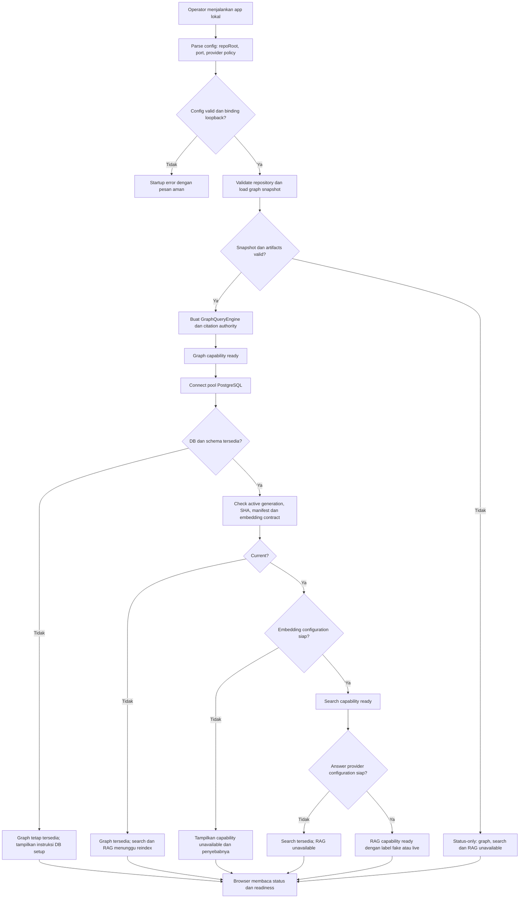
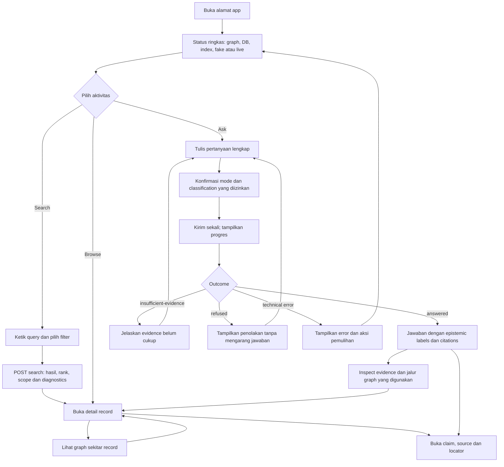
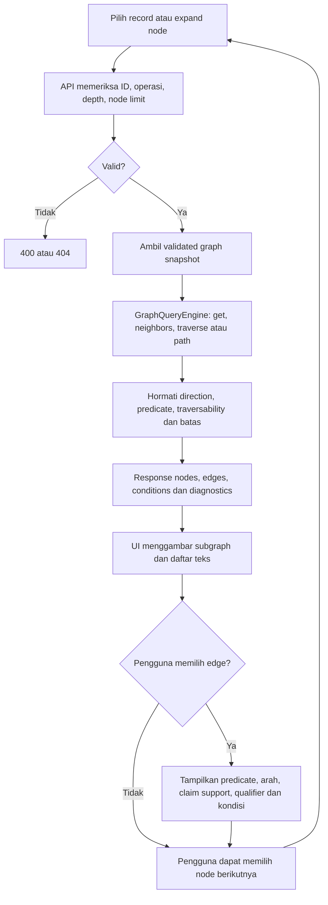
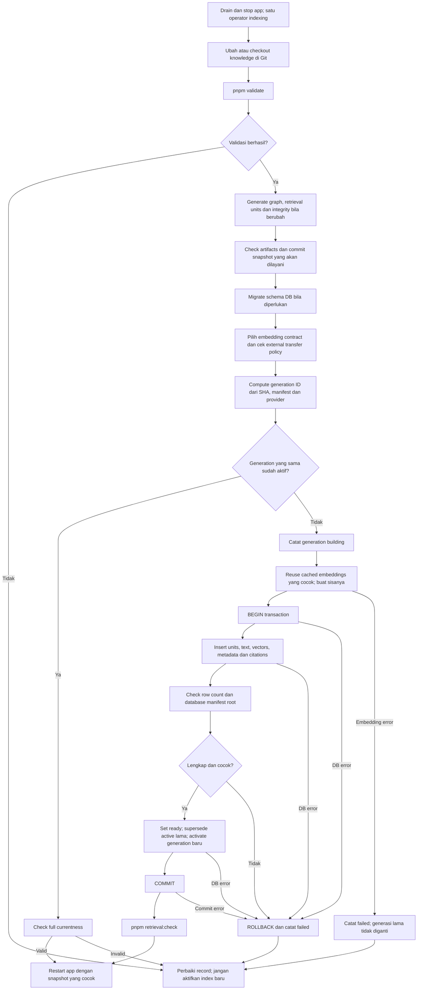
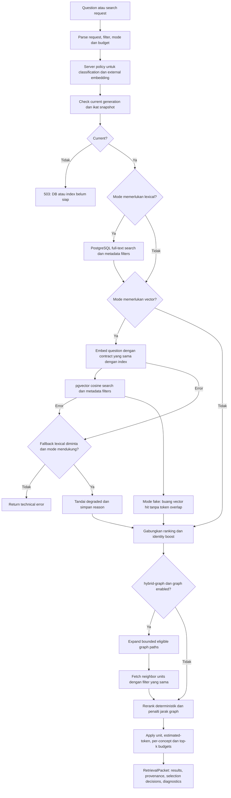
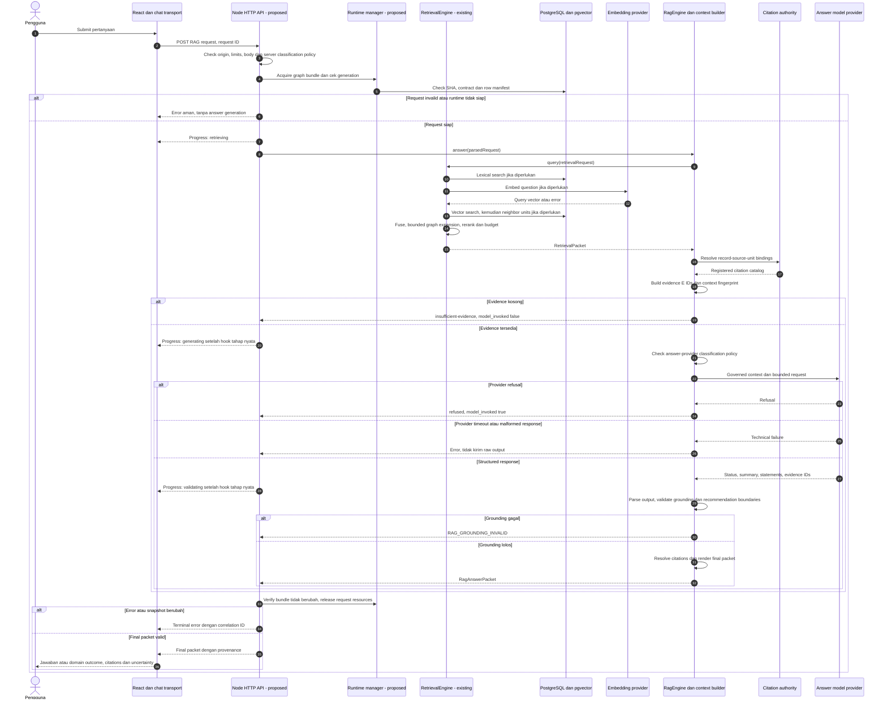
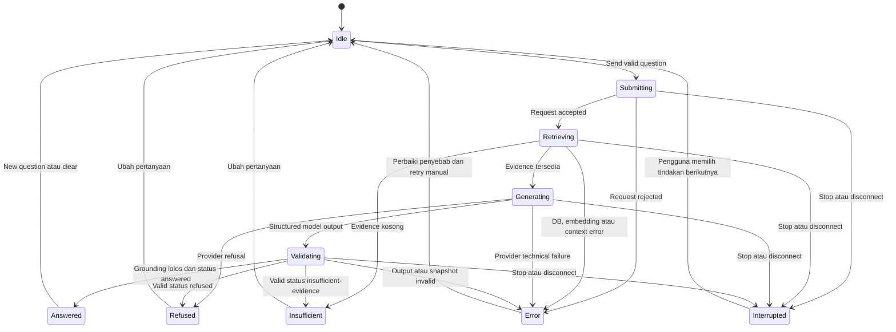

# App and RAG Flows

Tanggal: 2026-09-16. Status: **proposed design**.
Mulai dari [Local Knowledge App Architecture](local-app-architecture.md).

Diagram menunjukkan target app lokal. Kotak HTTP/UI/runtime manager adalah
pekerjaan baru; graph, retrieval, indexing dan RAG core mengikuti implementasi
pada baseline `aa627019c3c29c08a1de94bdfa2f1e7c6f9b0c4f`.
Semua flowchart memakai Mermaid dan dapat dibaca di Markdown preview yang
mendukung Mermaid atau pada GitHub. Diagram adalah desain, bukan bukti runtime.

## F1. Startup dan readiness app

Readiness berarti pemeriksaan lokal/DB berhasil; startup tidak perlu membuat
panggilan model berbayar untuk membuktikan layanan eksternal sedang sehat.
Valid credentials/provider availability tetap dapat gagal saat request.
Status endpoint tidak membocorkan key atau connection string.

## F2. Perjalanan pengguna di app

Setiap pertanyaan awal berdiri sendiri. Chat bubble sebelumnya hanya riwayat
tampilan; app meminta pertanyaan lengkap untuk follow-up yang ambigu. Request
preview dan answer tidak berbagi evidence dari browser yang dianggap terpercaya.
Mengklik source hanya membuka sumber; tidak mengubah source admission atau status
review claim. Pengguna dapat membersihkan tampilan tanpa menghapus knowledge.

## F3. Detail dan graph explorer

Query graph memakai artifacts/memori, bukan SQL graph database. Tampilan awal
berfokus pada subgraph yang eligible. Jika kelak ada mode inspection untuk edge
excluded, edge tersebut diberi penanda dan tidak dipakai memperluas retrieval.
Kondisi edge yang tampil adalah persyaratan; graph explorer tidak menyatakan
bahwa proyek pengguna sudah memenuhi persyaratan itu. Tidak ada transitive
inference otomatis hanya karena dua node terhubung.

## F4. Knowledge ingestion dan indexing oleh operator

Aktivasi transaksi dan embedding cache sudah ada di
[indexer](../src/retrieval-indexer.ts). Drain/restart, read-only app role, dan
operational controls adalah rancangan baru. Status ready berada dalam transaksi;
bukan layanan queue terpisah. Index yang lama tersisa tidak otomatis cocok dengan
checkout baru. Pergantian model jawaban tidak sama dengan pergantian embedding.

App tidak otomatis mengunduh seluruh website sumber dan tidak mengindeks input
chat sebagai knowledge. Source admission dan authoring tetap proses repository.
Tidak ada tombol browser yang menjalankan arbitrary migration atau git command.

## F5. Retrieval: dari query ke evidence candidates

Flow mengikuti [RetrievalEngine](../src/retrieval-query.ts): lexical saat ini
dijalankan sebelum embedding/vector, bukan query paralel. Fusion menggunakan
rank-based scoring; reranking saat ini deterministik, bukan LLM/cross-encoder.
Default RAG tidak mengizinkan degraded lexical fallback. Jika opsi itu dibuka
kelak, UI harus menampilkan hasil degraded secara eksplisit.

Metadata filters diterapkan pada pencarian awal dan neighbor fetch. Traversability
adalah eligibility yang ditetapkan governance, bukan pemeriksaan otomatis kondisi
proyek. Jalur graph, relationship IDs dan qualifier dipertahankan untuk inspeksi.
Hasil retrieval belum merupakan jawaban dan tidak membuktikan dukungan semantik
setiap kalimat model.

## F6. RAG request: urutan panggilan dan cabang kegagalan

Progress hook pada generating/validating belum ada dalam interface core dan harus
ditambahkan secara eksplisit bila streaming tahap dipilih. Facade tidak boleh
melakukan retrieval dua kali hanya untuk menampilkan progress. Transport JSON dan
stream harus memanggil layanan RAG yang sama. Cabang teknis retrieval, classification
atau context validation yang gagal juga berakhir pada error aman; sequence di atas
meringkas subflow retrieval yang lengkap pada F5.

Citation authority hanya menerima sumber terdaftar/admitted yang sah untuk
record/unit. Binding yang tidak dapat di-resolve tidak menjadi catalog entry.
Saat output diperiksa, statement assertive harus memiliki dukungan dan citation
yang dapat di-resolve. Model tidak menentukan URL final. Rujukan lokal per packet
tidak boleh dicampur antara dua request.

Validator menguji bentuk output, evidence/claim references, sumber, batas jumlah,
epistemic labels, confidence dan kelengkapan recommendation. Validasi tersebut
tidak membuktikan bahwa semua paraphrase, summary atau inference benar secara
semantik. UI mempertahankan label dan qualifier; live quality evaluation tetap
bagian tersendiri dari penerimaan app.

## F7. State tampilan Ask, progres dan cancel

State adalah presentasi proses, bukan lifecycle knowledge. Dengan JSON transport,
beberapa tahap dapat ditampilkan sebagai satu status working sampai final datang.
Dengan stream, setiap event membawa `request_id` dan urutan monoton; UI hanya
menerima event dari request aktif. Setiap request mempunyai satu terminal outcome.
Response lama yang terlambat setelah Stop tidak boleh mengubah percakapan baru.

Sebelum final: tampilkan status, bukan raw token model. Setelah final: render
structured statements dan citation panel. Reconnect tidak otomatis mengulang
panggilan berbayar. Stop menutup transport; jaminan abort provider membutuhkan
perluasan adapter yang dijelaskan pada dokumen arsitektur.

## Checklist penerimaan flow saat implementasi

- F1: DB mati tetap mengizinkan graph valid; snapshot invalid tidak dilayani.
- F2/F3: ID tidak dikenal, graph limit, edge direction dan kondisi tampil benar.
- F4: Failed indexing tidak mengaktifkan generasi parsial; mismatch SHA ditolak.
- F5: Filter tetap berlaku setelah graph expansion; fallback tidak diam-diam.
- F6: Empty evidence tidak memanggil model jawaban; invalid citation dan output
  tidak tampil; provider error dibedakan dari domain insufficient/refused.
- F7: Double submit dicegah, late response diabaikan, error/cancel tidak menjadi
  jawaban sukses, dan keyboard/screen-reader dapat mengikuti perubahan status.
- Semua final packet membawa provenance yang cocok dengan evidence yang terlihat;
  browser tidak mengirim sumber/claim buatannya sendiri untuk menjadi authority.

Diagram dan checklist adalah spesifikasi proposed. Bukti implementasi harus
berasal dari tes API/browser, DB integration dan evaluasi provider sesuai tahap.
